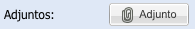

# Uso en SII del componente de Alfresco

## Modelo

El componente de Alfresco permite visualizar una lista de archivos determinado para una tabla y filtro en concreto, o la posibilidad de permitir el ingreso libre de archivos.

**Lista de Archivos**

- Insertar un registro en la tabla cgg_ecm_metadata. Que indicará la lista, la tabla y el filtro.
- Insertar registros en cgg_ecm_file, tantos como archivos se requieran.
- Insertar registros en cgg_ecm_file_index, para especificar los aspectos requeridos para cada archivo.

**Carga Libre**

- Insertar un registro en la tabla cgg_ecm_metadata. Que indicará la lista, la tabla y el filtro. En esta tabla hay que indicar que is_list es false y especificar files_repository.

### Caracteres Especiales en cgg_ecm_metadata.files_repository y cgg_ecm_file.file_repository

El servicio de carga de Alfresco es capáz de identificar variables en la tabla donde se asocian los adjuntos. Para ello debemos armar la URL de la siguiente manera:

1)Supongamos que queremos almacenar los archivos de una persona en una carpeta que se llame como el cliente y luego su número de cédula. 
 Pondríamos la siguiente cadena:

`clientes/@nombre_cli@/@identificacion@`

Esto generaría **clientes/Antonio/1710679968**

2)Ahora estamos en la tabla de Solicitudes y queremos almacenar en numero de solicitud y número de cédula del cliente. El campo número de cédula no está en la tabla a la cuál estamos añadiendo
los archivos, tenemos que especificar la relación para que obtenga la data de una tabla relacionada, de la siguiente forma:

`campo_de_relacion;tabla_de_relacion.campo_a_mostrar`

`solicitudes/@numero_solicitud@/@cliente_id;tabla_cliente.cedula@`

Esto generaría **solicitudes/SC-100/1710679968**

## Componentes

Se crearon 2 componentes Javascript adicionales para poder utilizar el modelo de Alfresco en el sistema:

- Ext.ux.form.AlfrescoFM
- AlfrescoMng

Para insertar el botón que hace la llamada a AlfrescoMng es necesario identificar 3 parámetros:

1. **tableName** La tabla que hará referencia el modelo.
2. **recordID** El identificador del registro.
3. **filter** El filtro (opcional) para identificar varios modelos para la misma tabla

<pre>   
    var adjunto = new Ext.ux.form.AlfrescoFM({
        id:'identificador_componente',  //(opcional)
        name:'nombre_componente',       //(opcional)
        fieldLabel :'Adjuntos',         //(opcional -> Despliega la etiqueta del comoponente. Si no se define, aparece solo el botón)
        text: 'Adjunto',                //(opcional -> Texto del botón)
        tableName : 'CGG_TABLA_DE REFERENCIA',
        recordID : 'RECORD_ID',
        validateRecordID: false,        //(opcional -> Valida que recordID tenga valor antes de ejecutarse)
        filter: 'FILTRO_PARA_EL_MODELO' //(opcional)
    });
</pre>
Esto generará un botón con el ícono de "attachment" que hará la llamada a los servicios para cargar el modelo de Alfresco relacionado.

*Se pueden agregar además todas las propiedades heredadas del componente Ext.Button.*